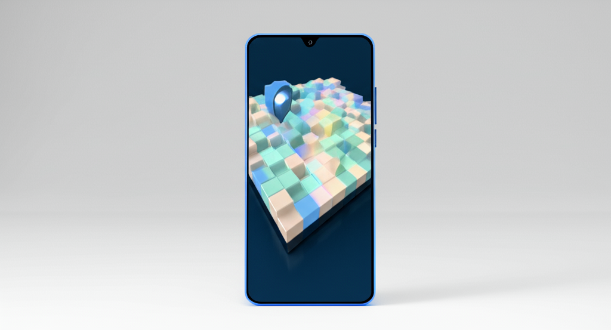

# Gemini Image Generation API

A Next.js application that leverages Google's Gemini 2.0 Flash experimental model to generate and edit images through a RESTful API. This project can run standalone or via Docker Compose, featuring persistent storage for images and metadata, interactive API documentation with Swagger UI, and helper scripts for management. The application provides endpoints for image generation from text prompts, image editing with instructions, and health monitoring, making it ideal for developers looking to integrate AI-powered image capabilities into their applications or services.

## Sample Use Cases & Results

### Portrait & People Photography
Generate professional-quality portraits and people photography for business, social media, or marketing.


*Prompt: "Professional portrait photo of a business person in a modern office setting, wearing a suit, photorealistic, 8k resolution, studio lighting"*

### Product Visualization & Editing
Create product images and easily modify product attributes with simple text instructions.

**Original Product Image:**

*Prompt: "Modern smartphone with sleek design on a white background, product photography, 8k resolution, studio lighting"*

**Edited Product Image:**

*Edit Prompt: "Change the smartphone color to blue and add a holographic display showing a 3D map"*

## Prerequisites

- Node.js 18+ installed
- Google Cloud account with Gemini API access
- Gemini API key

## Quick Start

1. **Clone the repository**
   ```bash
   git clone https://github.com/jkmaina/gemini-image-generator.git
   cd gemini-image-generator
   ```

2. **Install dependencies**
   ```bash
   npm install
   ```

3. **Set up environment variables**
   ```bash
   cp .env.example .env.local
   ```
   Edit `.env.local` and add your Gemini API key:
   ```
   GEMINI_API_KEY=your_api_key_here
   ```

4. **Start the development server**
   ```bash
   npm run dev
   ```

5. **Access the application**
   - Web Interface: http://localhost:3000
   - API Documentation: http://localhost:3000/docs

## Testing the API

### Using the Web Interface

1. Open http://localhost:3000 in your browser
2. Enter a text prompt describing the image you want to generate
3. Click "Generate" and wait for your image
4. For editing, select an existing image and provide editing instructions

### Using the API Directly

Generate a new image:
```bash
curl -X POST http://localhost:3000/api/generate \
  -H "Content-Type: application/json" \
  -d '{"prompt": "a professional headshot of a business executive"}'
```

Edit an existing image:
```bash
curl -X POST http://localhost:3000/api/edit \
  -H "Content-Type: application/json" \
  -d '{
    "imageUrl": "/generated-images/your-image-filename.png",
    "prompt": "change the background to a city skyline"
  }'
```

## Key Features

- **Image Generation**: Create images from text prompts using Gemini 2.0 Flash
- **Image Editing**: Modify existing images with text instructions
- **Persistent Storage**: Store generated images and their metadata
- **API Documentation**: Interactive Swagger UI documentation
- **Health Monitoring**: Health check endpoint for container orchestration
- **Rate Limiting**: Configurable rate limiting to prevent abuse
- **Automatic Cleanup**: Tools to manage and clean up old images

## Use Cases

- **Professional Portraits**: Generate headshots and professional photos
- **Product Photography**: Create and edit product images for e-commerce
- **Marketing Materials**: Design visual content for marketing campaigns
- **Social Media Content**: Generate engaging visuals for social platforms
- **UI/UX Prototyping**: Create interface mockups and design elements
- **Real Estate Visualization**: Generate or edit property images
- **Fashion & Apparel**: Visualize clothing items with different styles and colors

## Docker Support (Optional)

If you prefer using Docker:

```bash
# Start the application
docker-compose up -d

# Stop the application
docker-compose down
```

## Project Structure

```
├── app/                  # Next.js application code
│   ├── api/             # API routes
│   └── docs/            # API documentation
├── public/              # Static files
│   └── generated-images # Generated images storage
├── lib/                 # Utility functions
└── data/               # Metadata storage
```

## Technical Stack

- **Frontend/Backend**: Next.js 14
- **API Documentation**: Swagger UI / OpenAPI
- **Containerization**: Docker with Docker Compose (optional)
- **Image Generation**: Google Gemini 2.0 Flash API
- **Storage**: File-based with JSON metadata

## Contributing

1. Fork the repository
2. Create your feature branch (`git checkout -b feature/amazing-feature`)
3. Commit your changes (`git commit -m 'Add some amazing feature'`)
4. Push to the branch (`git push origin feature/amazing-feature`)
5. Open a Pull Request

## License

This project is licensed under the MIT License - see the LICENSE file for details.

## Support

If you find this project helpful, please give it a ⭐️ on GitHub!