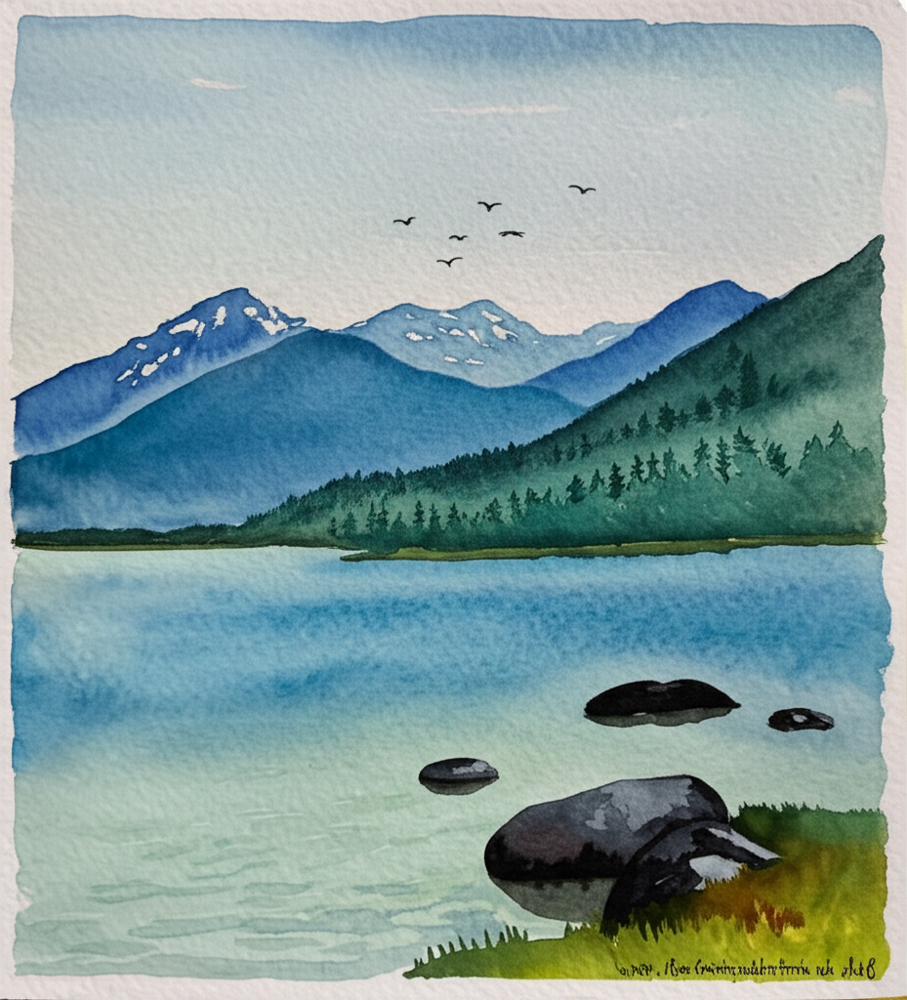

# Gemini Image Generation API

Generate and edit images using Google's Gemini 2.0 Flash model through a simple Next.js API. Perfect for developers looking to add AI image generation capabilities to their applications.




## Prerequisites

- Node.js 18+ installed
- Google Cloud account with Gemini API access
- Gemini API key

## Quick Start

1. **Clone the repository**
   ```bash
   git clone https://github.com/jkmaina/gemini-image.git
   cd gemini-image
   ```

2. **Install dependencies**
   ```bash
   npm install
   ```

3. **Set up environment variables**
   ```bash
   cp .env.example .env.local
   ```
   Edit `.env.local` and add your Gemini API key:
   ```
   GEMINI_API_KEY=your_api_key_here
   ```

4. **Start the development server**
   ```bash
   npm run dev
   ```

5. **Access the application**
   - Web Interface: http://localhost:3000
   - API Documentation: http://localhost:3000/docs

## Testing the API

### Using the Web Interface

1. Open http://localhost:3000 in your browser
2. Enter a text prompt describing the image you want to generate
3. Click "Generate" and wait for your image

### Using the API Directly

Generate a new image:
```bash
curl -X POST http://localhost:3000/api/generate \
  -H "Content-Type: application/json" \
  -d '{"prompt": "a cute robot painting a sunset"}'
```

Edit an existing image:
```bash
curl -X POST http://localhost:3000/api/edit \
  -H "Content-Type: application/json" \
  -d '{
    "imageId": "your-image-id",
    "prompt": "make the sunset more vibrant"
  }'
```

## Features

- 🎨 Generate images from text descriptions
- ✏️ Edit existing images with text instructions
- 📚 Interactive API documentation
- 💾 Persistent storage for generated images
- 🔍 Image metadata tracking
- 🚀 Fast response times

## Docker Support (Optional)

If you prefer using Docker:

```bash
# Start the application
docker-compose up -d

# Stop the application
docker-compose down
```

## Project Structure

```
├── app/                  # Next.js application code
│   ├── api/             # API routes
│   └── docs/            # API documentation
├── public/              # Static files
│   └── generated-images # Generated images storage
├── lib/                 # Utility functions
└── data/               # Metadata storage
```

## Contributing

1. Fork the repository
2. Create your feature branch (`git checkout -b feature/amazing-feature`)
3. Commit your changes (`git commit -m 'Add some amazing feature'`)
4. Push to the branch (`git push origin feature/amazing-feature`)
5. Open a Pull Request

## License

This project is licensed under the MIT License - see the LICENSE file for details.

## Support

If you find this project helpful, please give it a ⭐️ on GitHub!